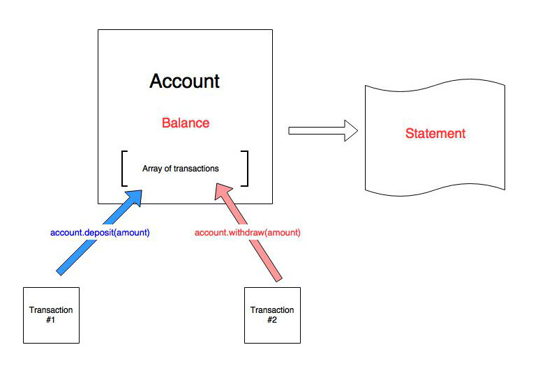

 

# Bank Tech Test

### What is required
In this tech test, we are required to write a program that will allow a user to interact with a simple bank account (create account, deposit/withdraw money and get a statement).

As this is a test test, the minimum requirements need to be fulfilled and nothing more than that. This shows the aptitude of being able to discern on what is required and not overthink/overcomplicate things.


### User Stories

```
As a user,
So that I can keep my money safe,
I want to be able to deposit money into a bank account
```

```
As a user,
So that I can have cash,
I would like to be able to withdraw money from my bank account.
```

```
As a user,
So that I cannot go overdrawn,
I would like to be able to only withdraw money up to my available balance from my bank account.
```

```
As a user,
So that my statement makes sense to me,
I would like to have dates next to each entry(deposit/withdrawal).
```

```
As a user,
So I don't loose track of my spending,
I would like to be able to see my balance.
```

```
As a user,
So that I can keep track of my spending,
I would like to be able to see a statement.
```
### Diagram of interactions



### How to run the program
In order to run this program the following steps need to be followed:
* Clone this depository onto a local directory

* Navigate to the directory, where you cloned the depository and open ***SpecRunner.html***, which is located in the ```spec ``` folder in your preferred browser. This will show all the test running for this app.

* Open the console of your web browser and then you can start interacting with the app. The following commands are available:
  * create new account ``` account = new Account()```
  * deposit money to account ```account.deposit(amount)```
  * withdraw money from account ``` account.withdraw(amount)```
  * show account balance ``` account.showBalance()```
  * print account statement ``` account.showBankStatement()```


### Tech Test Acceptance Criteria
##### Requirements

* You should be able to interact with your code via the JavaScript console.  (You don't need to implement a command line interface that takes input from STDIN.)
* Deposits, withdrawal.
* Account statement (date, amount, balance) printing.
* Data can be kept in memory (it doesn't need to be stored to a database or anything).

##### Sequence of events/actions
Upon completion of the program, the following sequence should be possible

**Given** a client makes a deposit of 1000 on 10-01-2012  
**And** a deposit of 2000 on 13-01-2012  
**And** a withdrawal of 500 on 14-01-2012  
**When** she prints her bank statement  
**Then** (s)he would see
```
date || credit || debit || balance
14/01/2012 || || 500.00 || 2500.00
13/01/2012 || 2000.00 || || 3000.00
10/01/2012 || 1000.00 || || 1000.00
```
